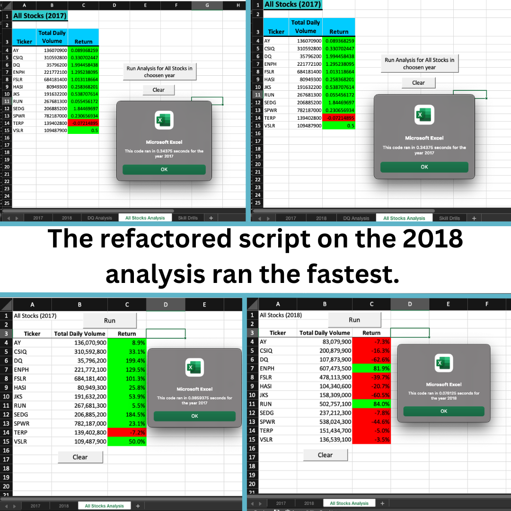
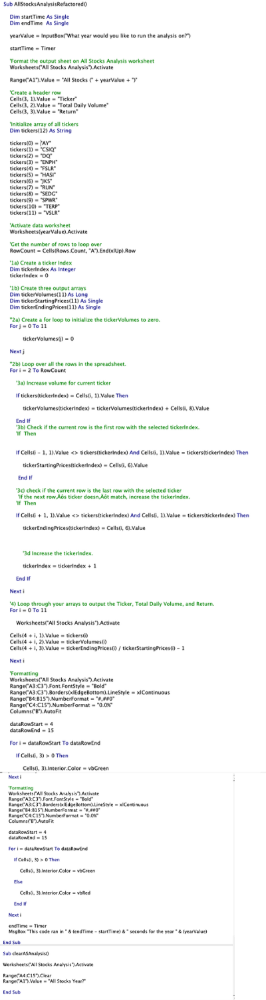

# READ ME
# An Analysis on Stocks

Description: In this analysis we are looking at a number of green energy stocks. We will analyze the data we have from 2017 and 2018 in order to determine if its a good idea to invest in any of them.   

## Results
- [Green Stocks Spreadsheet](green_stocks.xlsm)
- [VBA Challenge Spreadsheet](VBA_Challenge.xlsm)

Results: Using images and examples of your code, compare the stock performance between 2017 and 2018, as well as the execution times of the original script and the refactored script.

## Visualizations
- Timed Results 

- Code

## Summary

Summary: In a summary statement, address the following questions.
What are the advantages or disadvantages of refactoring code?
How do these pros and cons apply to refactoring the original VBA script?
