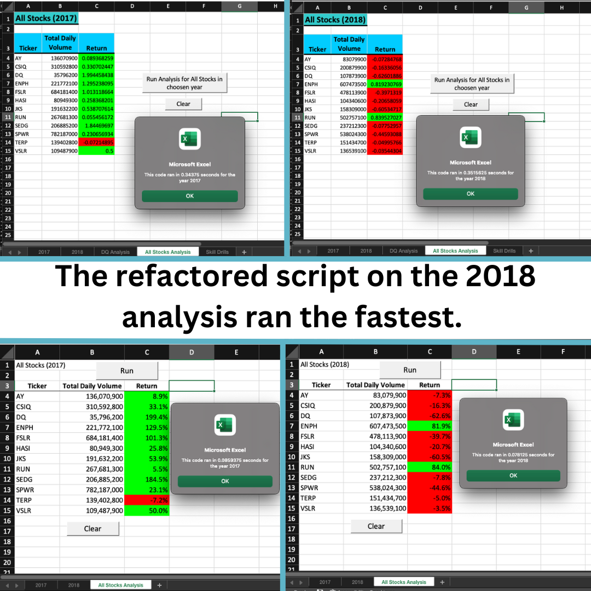

# READ ME
# An Analysis on Stocks

Description: In this analysis we are looking at a number of green energy stocks. We will analyze the data we have from 2017 and 2018 in order to determine if its a good idea to invest in any of them.   

## Results
- [Green Stocks Spreadsheet](green_stocks.xlsm)
- [VBA Challenge Spreadsheet](VBA_Challenge.xlsm)

Results: Using images and examples of your code, compare the stock performance between 2017 and 2018, as well as the execution times of the original script and the refactored script.
As these images below show 2017 was a better year for all of these stocks. 

## Images
- Timed Results 

- Code

## Summary

There are many advantages to refactoring code. The most obvious being that time can be saved in runnung the code the shoter it is. If one is planning on executing a very large data set then this can be very important. It also helps the coder learn and level up their skills when they find shorter and better ways to execute a long swath of code. Some disadvantages are that it can take aditional time for the coder to refract the code, but as mentioned, this can pay off for the coder in the long run. 

These pros and cons apply to refactoring the original VBA script in a big way. The time for the code to run now takes a fraction of its original run time and I learned a lot in the end. 
